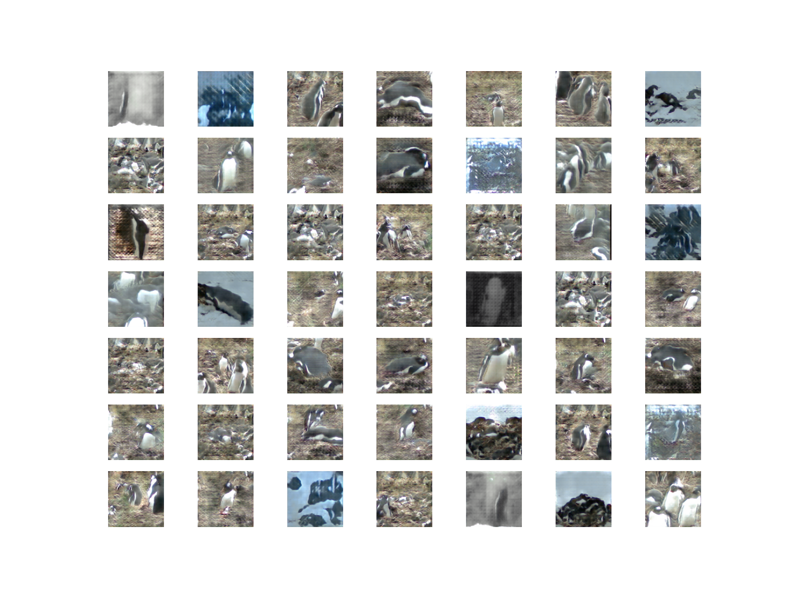

# This penguin does not exist

With the code in this repository you can train a neural network, which will create penguin images like in this example.



## Download images

### Run locally
```
gcloud ai-platform local train --module-name trainer.download --package-path ./package/trainer -- --job-dir ../tmp/dataset
```

### Run on GCP
```
gcloud ai-platform jobs submit training DownloadImages --module-name trainer.download --package-path ./package/trainer --job-dir=gs://this-penguin-does-not-exist/dataset --config=gcp-download.yaml
```


## Create dataset

### Run locally
```
gcloud ai-platform local train --module-name trainer.create --package-path ./package/trainer -- --job-dir ../tmp/dataset
```

### Run on GCP
```
gcloud ai-platform jobs submit training CreateDataset --module-name trainer.create --package-path ./package/trainer --job-dir=gs://this-penguin-does-not-exist/dataset --config=gcp-create.yaml
```


## Train model

### Run locally
```
gcloud ai-platform local train --module-name trainer.train --package-path ./package/trainer -- --job-dir ../tmp/
```

### Run on GCP
```
gcloud ai-platform jobs submit training TrainModel --module-name=trainer.train --package-path=./package/trainer --job-dir=gs://this-penguin-does-not-exist --config=gcp-train.yaml
```

